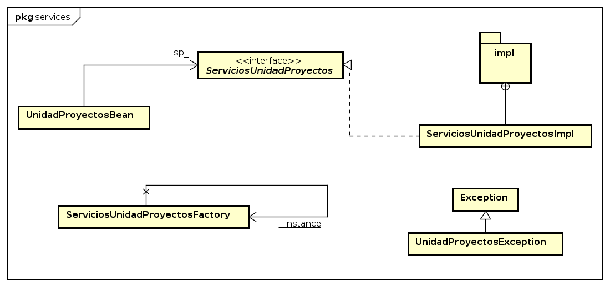
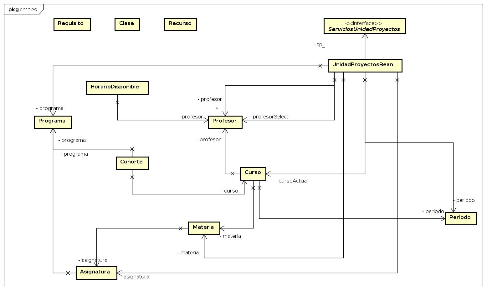
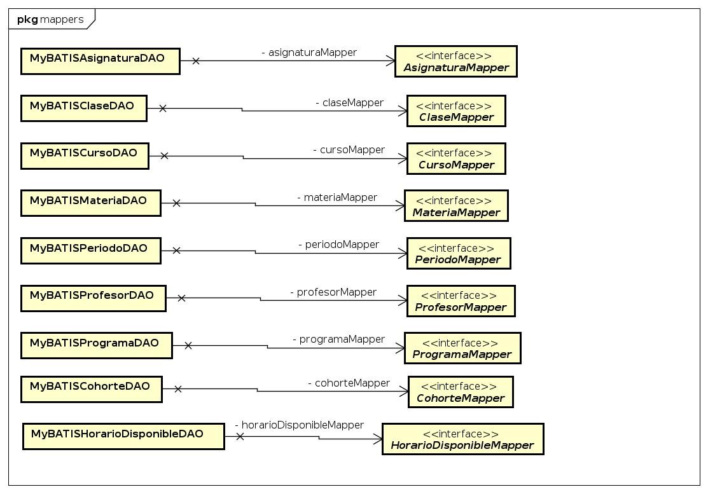
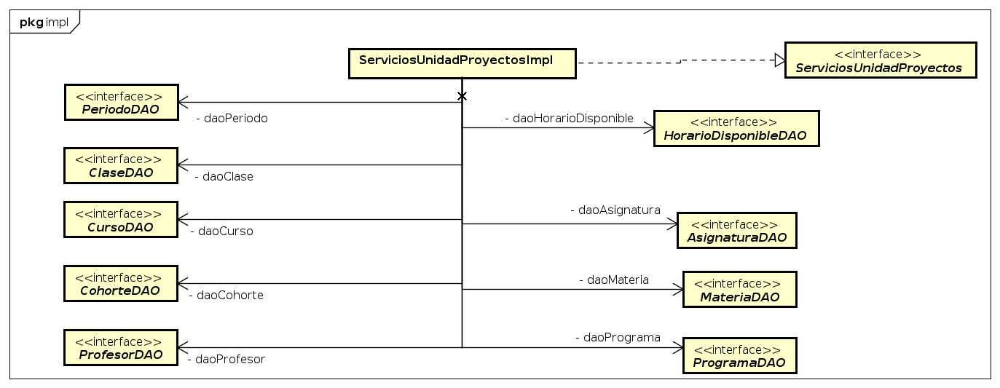
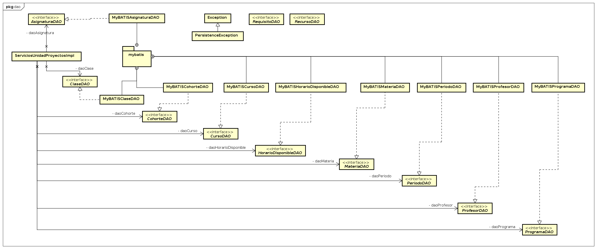

# UP-TEHO

ESCUELA COLOMBIANA DE INGENIERÍA JULIO GARAVITO

PROCESOS DE DESARROLLO DE SOFTWARE 2017-1

PROFESOR: Hector Fabio Cadavid Rengifo [Dueño del Producto]

INTEGRANTES: 

* Daniel Ospina [TEAM] [SCRUM MASTER]
* Andrés Felipe Pardo [TEAM]
* Juan Villate [TEAM]
* Jefferson Castañeda [TEAM]
* Juan Camilo Mantilla [TEAM]
* Gabriel Peña [TEAM]

## DESCRIPCIÓN DEL PRODUCTO

## ARQUITECTURA Y DISEÑO DETALLADO
### Modelo Entidad Relación

### Diagrama de Clases
El modelo se encuentra seccionado en sus partes más importantes

#### Servicios

#### Entidades

#### Mappers

#### DAOs

#### MyBatis

## DESCRIPCION DEL PROCESO

